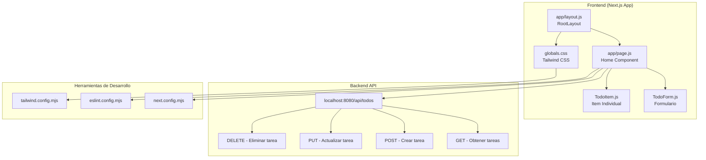
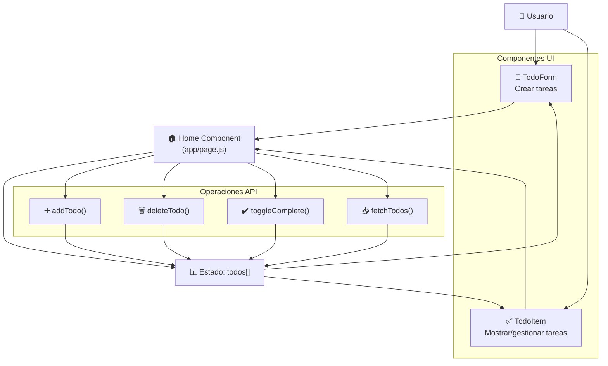
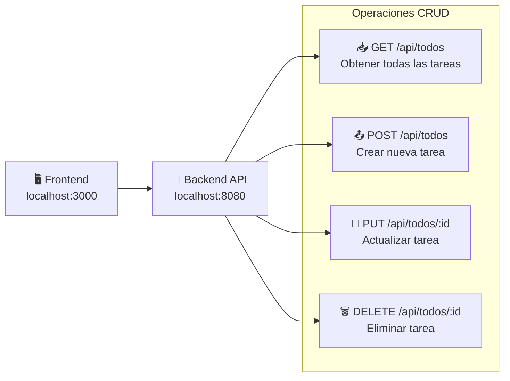

## TodoList App Frontend
Aplicación web moderna para gestión de tareas desarrollada con Next.js, React y Tailwind CSS. Proporciona una interfaz limpia y responsiva para crear, gestionar y organizar tareas diarias con seguimiento de fechas y horarios.

## 🚀 Tecnologías Principales

| Tecnología | Versión | Propósito |
|------------|---------|-----------|
| **Next.js** | 15.1.6 | Framework React con App Router |
| **React** | 19.0.0 | Biblioteca de componentes UI |
| **Tailwind CSS** | 3.4.1 | Framework CSS utility-first |
| **ESLint** | 9.x | Calidad de código y linting |
| **PostCSS** | 8.x | Post-procesamiento CSS |

## 📁 Estructura del Proyecto

```
todolist-app-frontend/
├── app/                     # App Router de Next.js
│   ├── components/          # Componentes reutilizables
│   │   ├── TodoForm.js      # Formulario de creación de tareas
│   │   └── TodoItem.js      # Componente de tarea individual
│   ├── layout.js           # Layout raíz de la aplicación
│   ├── page.js             # Página principal (Home)
│   └── globals.css         # Estilos globales con Tailwind
├── public/                 # Assets estáticos
├── next.config.mjs         # Configuración de Next.js
├── tailwind.config.mjs     # Configuración de Tailwind
├── eslint.config.mjs       # Configuración de ESLint
├── postcss.config.mjs      # Configuración de PostCSS
└── package.json           # Dependencias y scripts
```

## 🏗️ Arquitectura de la Aplicación

### Diagrama de Arquitectura General



### Flujo de Datos y Componentes



## 🧩 Componentes Principales

### TodoForm Component

Componente responsable de la creación de nuevas tareas con validación de formulario.

**Características:**
- Gestión de estado local con `useState` para descripción, fecha y hora
- Validación de campo obligatorio (descripción)
- Reset automático del formulario tras envío exitoso
- Integración con Tailwind CSS para estilos responsivos 

**Estructura del formulario:**
- Campo de texto obligatorio para descripción
- Campo de fecha opcional
- Campo de hora opcional
- Botón de envío con estilos hover 

### TodoItem Component

Componente para mostrar y gestionar tareas individuales.

**Funcionalidades:**
- Checkbox para marcar/desmarcar como completada
- Visualización condicional de fecha y hora
- Botón de eliminación
- Estilos condicionales para tareas completadas 

## ⚡ Funcionalidades Principales

| Funcionalidad | Descripción | Componente | API Endpoint |
|---------------|-------------|------------|--------------|
| **📋 Listado dinámico** | Visualización de todas las tareas | `TodoItem` | `GET /api/todos` |
| **➕ Creación de tareas** | Formulario con fecha y hora opcionales | `TodoForm` | `POST /api/todos` |
| **✔️ Toggle completado** | Marcar/desmarcar tareas como completadas | `TodoItem` | `PUT /api/todos/:id` |
| **🗑️ Eliminación** | Remover tareas de la lista | `TodoItem` | `DELETE /api/todos/:id` |
| **🔄 Actualización en tiempo real** | Sincronización automática con backend | `Home` | Todos los endpoints |
| **📱 Diseño responsivo** | Interfaz adaptable con Tailwind CSS | Todos | N/A | 

## 🛠️ Configuración y Desarrollo

### Scripts Disponibles

| Script | Comando | Descripción |
|--------|---------|-------------|
| **Desarrollo** | `npm run dev` | Inicia servidor de desarrollo con Turbopack |
| **Build** | `npm run build` | Crea build optimizado para producción |
| **Start** | `npm run start` | Inicia servidor de producción |
| **Lint** | `npm run lint` | Ejecuta verificaciones de calidad de código | 

### Configuración del Layout

El componente `RootLayout` establece la estructura base de la aplicación:

- **Fuentes**: Geist y Geist_Mono de Google Fonts
- **Idioma**: Configurado para español (`lang="es"`)
- **Metadatos**: Título y descripción para SEO
- **Estilos**: Variables de fuente y antialiasing 

## 🌐 Integración con Backend

La aplicación se conecta con un backend API REST en `localhost:8080`:

### Endpoints API



### Gestión de Estado

El estado se maneja centralmente en el componente `Home` usando `useState`: 

## 🎨 Sistema de Estilos

La aplicación utiliza Tailwind CSS con un sistema de diseño consistente:

- **Esquema de colores**: Fondo gris oscuro con acentos azules
- **Estados interactivos**: Efectos hover y focus
- **Layout**: Flexbox con espaciado gap
- **Tipografía**: Fuentes Geist con antialiasing

## 🚀 Inicio Rápido

1. **Clonar el repositorio**
2. **Instalar dependencias**: `npm install`
3. **Iniciar desarrollo**: `npm run dev`
4. **Abrir navegador**: `http://localhost:3000`

**Nota**: Asegúrate de que el backend API esté ejecutándose en `localhost:8080`

## Notes

Esta aplicación representa una implementación completa de frontend para gestión de tareas, utilizando las mejores prácticas de React y Next.js. La arquitectura modular permite fácil mantenimiento y extensión de funcionalidades. El sistema de componentes está diseñado para ser reutilizable y la integración con el backend es robusta con manejo de errores implícito en las operaciones async/await.
